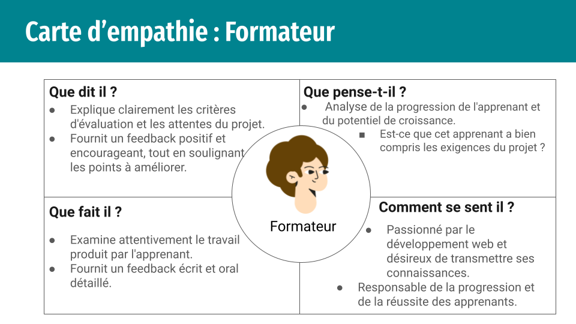

# besoin 
 
## Empathie

### Carte d'empathie : Formateur

 

### Carte d'empathie : Apprenant

## Définir le problème
l'absence d'un outil ou d'une plateforme d'évaluation dédié crée une déconnexion entre les formateurs et les apprenants, ce qui entrave la communication efficace du feedback, le suivi des progrès d'apprentissage et, en fin de compte, le développement optimal des compétences.

## Ideation
Développer une application web ou une plateforme spécialement conçue pour l'évaluation basée sur des projets: Cette plateforme pourrait automatiser la génération de feedback, fournir aux apprenants des rapports détaillés et permettre aux formateurs de suivre les progrès et d'offrir des conseils personnalisés.