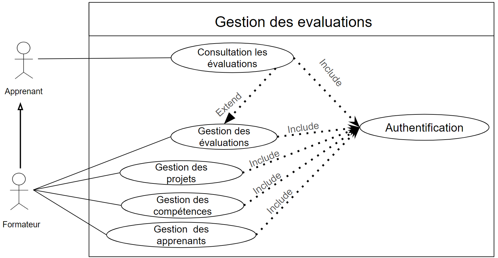
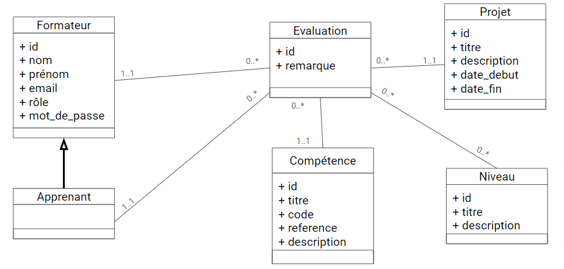

# Conception

## Diagramme de cas d'utilisation

## Diagramme de classe

 
 
## Diagramme de séquence
### Scénario nominale: Ajouter une évaluation 

 .png)

### Scénario alternatif: Ajouter une évaluation (évaluation existe déjà )

 .png)
